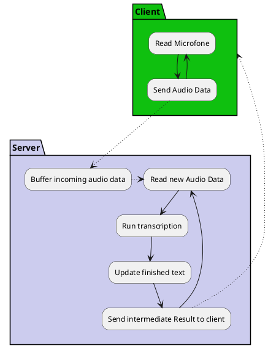

# faster-whisper-life-transcribing
An attempt to builds FastAPI based web socket server, to transcribe speech as fast as possible using faster-whisper

[faster whisper](https://github.com/guillaumekln/faster-whisper) is a [whisper](https://openai.com/research/whisper)
implementation allowing speech to text recognition using the OpenAI whisper model. For details
check out their GitHub page.

NOTE: This is more of an personal experiment than a product or anything I would advice to use in production.
But if you are interested, feel free to contribute, ask questions and try it out if it helps you in your use case.

This is an attempt to provide a FastAPI + web socket implementation for life speech transcription, similar
to what you get from the google speech recognition service.

## What?

The Idea is to receive streaming (life) audio data from the client and continuously run faster-whisper on it to send back
the intermediate result to the client.

Whenever the beginning of the result can be considered stable enough (and how to judge that is the tricky part)
so it won't change on receiving further audio, the transcription is saved and the audio removed so that it wont be run again
through whisper.

## Why?

For one, it gives you (or your user) an "early" preview (earlier, than if you would run it afterwards) of what they are saying.

Secondly, it can reduce the time between the user speaking and the transcription result being finished because
part of the transcription may have been done earlier and does not have to be recognized again. But that is only the case of the speech
is long enough.

## How?

1. The a client opens a web socket connection and streams audio to the server.
2. The server (the application in this repo) buffers the data and opens
   a worker thread and continuously runs "faster whisper" in the so far received data.
3. When the thread finishes a transcription, it can decide that the beginning of the
   transcription will not change anymore even with more audio data.
   It then removes the audio data and stores the intermediate result.

